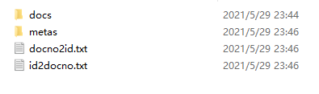
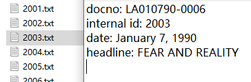
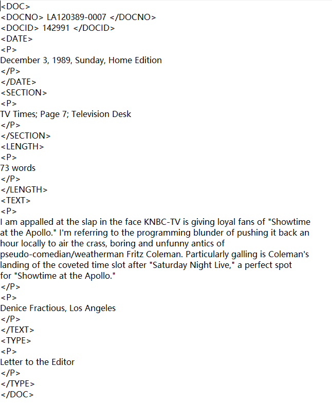

## Extract MetaData from collection

* [Running Instruction](#instruction)
* [Examples](#examples)

## Instruction

### 1. To ExtractMetaData, run the following commands sequentially:
```
.\ExtractMetaData\src\hw1\javac DocProcessor.java MyGZFile.java IndexEngine.java
```
```
.\ExtractMetaData\src>java hw1.IndexEngine [path to latimes.gz(TREC data)] [path to store metadatas and resolved documents]
```

### 2. To get the metadata of a document, run the following commands sequentially:
```
.\SearchMetaData\src\hw1>javac GetDoc.java
```

```
.\SearchMetaData\src>java hw1.GetDoc [where you stored metadatas and resolved documents] ["docno" or "id"] [corresponding docid or id]
```

## Examples 
### 1. Generated metadata directory:


### 2. One of the document metadatas:


### 3. One of the extracted documents from latimes.gz:
