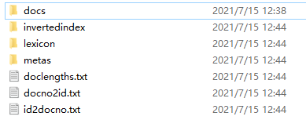
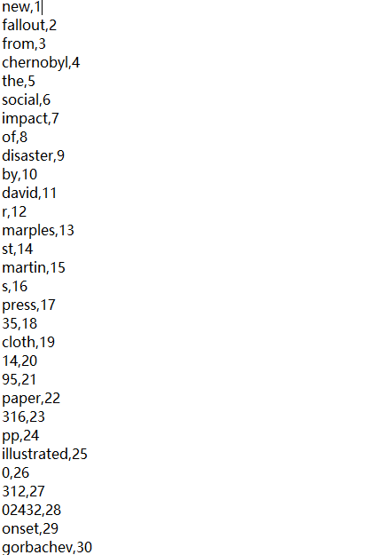
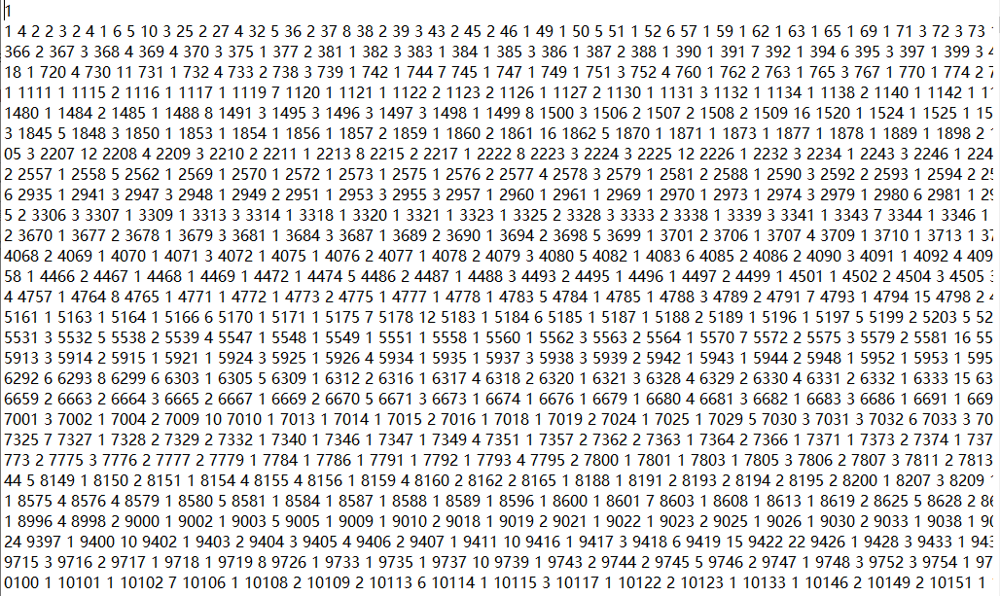
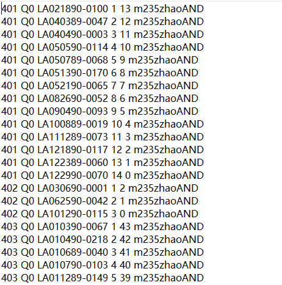

## Tokenize the collection of documents, retrieve and store length of each document, generate a termid for each term/token/word and store in a lexicon file, generate a posting list for each term and store in a file.

* [Running Instruction](#instruction)
* [Examples](#examples)

## Instruction
### 1. To tokenize, get the lexicon(dictionary), and get the postings lists:
```
.\ModifiedIndexEngine\src\hw2>javac DocProcessor.java IndexEngine.java
```
```
.\ModifiedIndexEngine\src>java hw2.IndexEngine [path to latimes.gz(TREC data)] [path to store generated files]
```
### If there java.lang.OutOfMemoryError: Java heap space. Please try:
```
.\ModifiedIndexEngine\src>java -Xmx1000m hw2.IndexEngine [path to latimes.gz(TREC data)] [path to store generated files]
```

### 2. To perform BooleanAND Retrieval:
```
.\BooleanAND\src>javac BooleanAND.java
```
```
.\BooleanAND\src>java BooleanAND [directory location of generated files] queries.txt [name of file to store retrieval results]
```
Note: The second arg should be queries.txt, which is at .\BooleanAND\src\queries.txt. It keeps the information about 45 query topics.

After execution, the retireval results will be created at .\BooleanAND\src\\[name].txt

## Examples
### 1. Generated directory structure:


### 2. Lexicon 
### (Format of each line: term, termid)


### 3. Postings list
### (Format of each two lines: line1: termid line2: docid1,term_frequency1,docid2,term_frequency2,...)


### 4. BooleanAND retrieval result
### (Format of result: topicid, Q0, docno, rank, -rank, personalTag)
