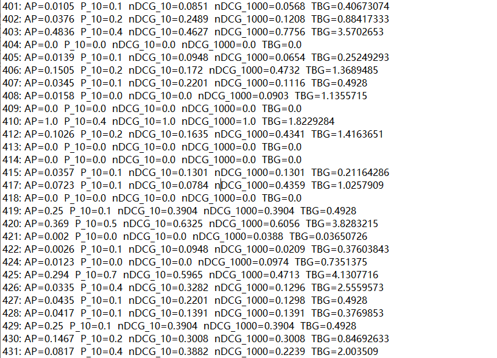

## Evaluate retrieval systems by several effectiveness methods

* [Running Instruction](#instruction)
* [Examples](#examples)

## Instruction
```
\Evaluation\hw3_code>javac evaluate.java
```
### qrels is a relevance judgments, the formate of each line: topicid, 0, docno, ifrelevant (0: not relevant, 1: relevant)
```
Evaluation>java evaluate [path to the qrels(a qrels file named "LA-only.trec8-401.450.minus416-423-437-444-447.txt" has been uploaded)] [path to retrieval result file (a list of result files is under the folder "results-files")]
```

## Examples
### 1. Evaluation Result of a result file
### (Format: topicid: AveragePrecision, PrecisionAt10, nDCGAt10, nDCGAt1000, Time_Biased_Gain)


