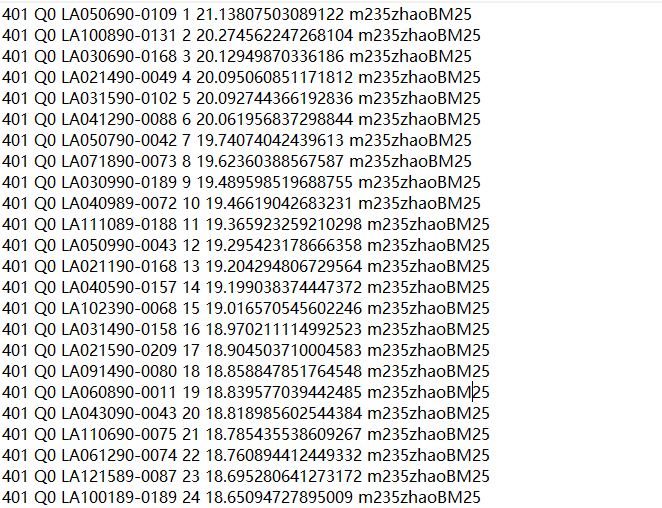

## BM25 Retrieval

* [Running Instruction](#instruction)
* [Examples](#examples)

## Instruction
```
BM25>javac BM25.java PorterStemmer.java
```
```
running: BM25>java BM25 [path to store generated files(same as that in "Tokenization&PostingsList&BooleanAND")]
```

## Examples
### 1. Result of 45 queries
### (Format: topicid: Q0, docno, rank, score, personalTag)


### 2. You can perform evaluation on BM25 result file as instructed in [Evaluation](../3\.Evaluation/README.md)
